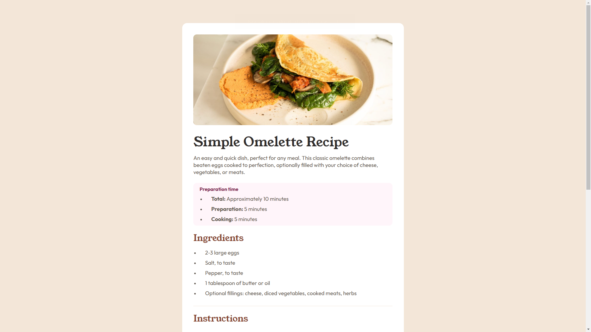
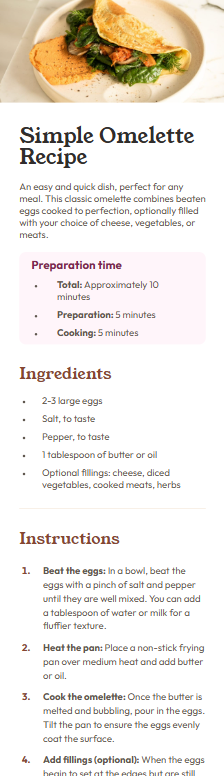

# Frontend Mentor - Recipe page solution

This is a solution to the [Recipe page challenge on Frontend Mentor](https://www.frontendmentor.io/challenges/recipe-page-KiTsR8QQKm). Frontend Mentor challenges help you improve your coding skills by building realistic projects.

## Table of contents

- [Overview](#overview)
  - [The challenge](#the-challenge)
  - [Screenshot](#screenshot)
- [My process](#my-process)
  - [Built with](#built-with)
  - [What I learned](#what-i-learned)
  - [Continued development](#continued-development)
  - [Useful resources](#useful-resources)
- [Author](#author)

## Overview

## The challenge

Your challenge is to build out this recipe page and get it looking as close to the design as possible.

You can use any tools you like to help you complete the challenge. So if you've got something you'd like to practice, feel free to give it a go.

Want some support on the challenge? [Join our community](https://www.frontendmentor.io/community) and ask questions in the **#help** channe

### Screenshot

## My process

### Built with

- CSS custom properties
- Flexbox
- CSS Grid
- Mobile-first workflow

### What I learned

- CSS grid, alignment, pseudo-elements

### Continued development

- Pseudo-classes
- Pseudo-elements
- How organized work directory better
- CSS Grid
- CSS Flexbox
- CSS units

### Useful resources

- [CSS List](https://www.w3schools.com/css/css_list.asp) - This helped me understand some li tag points.
- [Pseudo-element marker](https://www.w3schools.com/cssref/sel_marker.php) - This expanded my knowledge about pseudo-elements.
- [Git ignore](https://www.freecodecamp.org/news/gitignore-file-how-to-ignore-files-and-folders-in-git/) - This excelent article helped me see how the git track (or not) the work directory files.

## Author

- Frontend Mentor - [@Clar-Junior](https://www.frontendmentor.io/profile/Clar-Junior)
- Github - [@Clar-Junior](https://github.com/Clar-Junior)